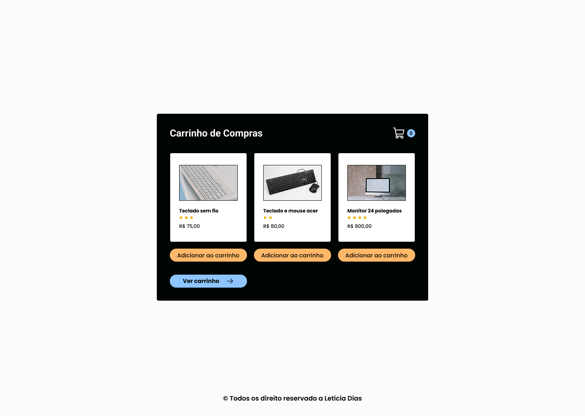

## 🛒 Shopping Cart – Vanilla JavaScript

### 🖼️ Preview



### Descrição

Um mini projeto de carrinho de compras, desenvolvido com Vanilla JavaScript, com foco em clean architecture, gerenciamento de estado e separação de responsabilidades.

Esse projeto foi estruturado para refletir práticas reais de desenvolvimento front-end, sem o uso de frameworks.

### 🎨 Design (Figma)

**You can check the UI/UX design for this project on Figma:**

👉 [Figma Design Link](https://www.figma.com/design/5TYUkxEsDniBNGqyAX5euy/Shopping-Cart?node-id=0-1&t=EDn7T350rCYKmOQO-1)

### 🧪 Tecnologias Utilizadas

- HTML5 (Semantic HTML)
- CSS3
- Vanilla JavaScript (ES Modules)
- LocalStorage API

### 🚀 Features

- Adicionar produtos ao carrinho
- Remover produtos do carrinho
- Limpar o carrinho de compras
- Persistir o estado do carrinho usando o localStorage
- Atualizações dinâmicas da interface do usuário

### 🧠 Arquitetura

O projeto segue uma arquitetura chamada Feature-Based Architecture, onde organiza o código por domínio em vez de por tipo de arquivo.

```bash
src/
├── assets/
├── features/
│   └── cart/
│       ├── cart.service.js   # Regra de negócio e gerenciamento de estado
│       └── cart.dom.js       # Renderização da UI (DOM manipulation)
├── pages/
├── styles/
└── main.js                   # Ponto de entrada da aplicação
```

### 🧩 Conceitos-chave aplicados

- Vanilla JavaScript (Módulos ES)
- HTML5 semântico
- Separação de responsabilidades
- Estrutura baseada em funcionalidades
- Princípios de Clean Code
- Delegação de eventos
- Atualizações de estado imutáveis

### ▶️ Como executar o projeto?

**1. Clone o repositório**

```bash

git clone https://github.com/leticiadia/shopping-cart.git

```

**2. Abra o projeto em um servidor local, como o Live Server.**

### 👩‍💻 Autora

Desenvolvido por Leticia Dias 💙
