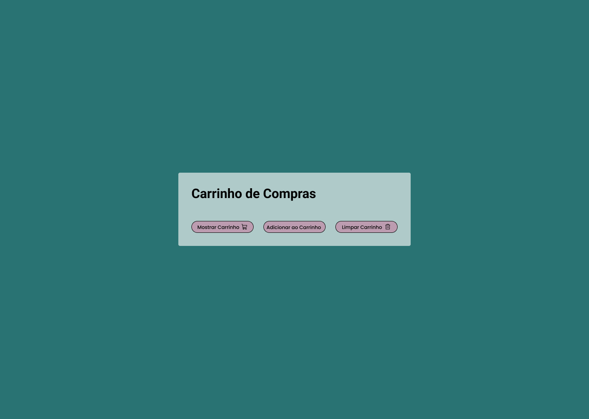

# Desafio: Carrinho de Compras (Nível Fácil)

### Sobre o Desafio 📝

Este desafio tem como objetivo testar suas habilidades com **HTML, CSS e JavaScript**, criando um carrinho de compras simples. A ideia é desenvolver a interface conforme um layout disponibilizado no **Figma** e implementar uma lógica básica para manipular a quantidade de produtos no carrinho.

### Como funciona? 👀🤔

O usuário poderá adicionar produtos ao carrinho, visualizar a quantidade de itens no carrinho e excluir todos os produtos do carrinho.

A interação será feita por meio de botões, e as ações serão exibidas por meio de alertas.

### Objetivo 🎯

O objetivo é você colocar em prática conceitos básicos utilizando HTML, CSS e JavaScript, que são muito importantes para o desenvolvimento web.

**O que você vai aprender:**

- Estruturação de uma página com HTML
- Estilização com CSS
- Uso de variáveis
- Uso de eventos em botões

### Requisitos do Desafio

- Criar a interface do carrinho de compras seguindo o layout disponibilizado no Figma.
- Utilizar HTML e CSS para estruturar e estilizar a página.
- Criar o botão de **Mostrar Carrinho**, com a seguinte lógica:
  > Ao clicar, deve exibir um alerta com a mensagem "Quantidade de produtos no carrinho: X", onde X é a quantidade atual de produtos.
- Criar o botão de **Adicionar ao Carrinho**, com a seguinte lógica:
  > Ao clicar, deve exibir um alerta com a mensagem "Produto adicionado ao carrinho" e aumentar a quantidade de produtos no carrinho.
- Criar o botão de **Limpar Carrinho**, com a seguinte lógica:
  > Ao clicar, deve remover a quantidade de produtos no carrinho e exibir um alerta com a mensagem "Seu carrinho foi esvaziado!".

### Link 📎

[Figma - Projeto](https://encurtador.com.br/a6vBy)
