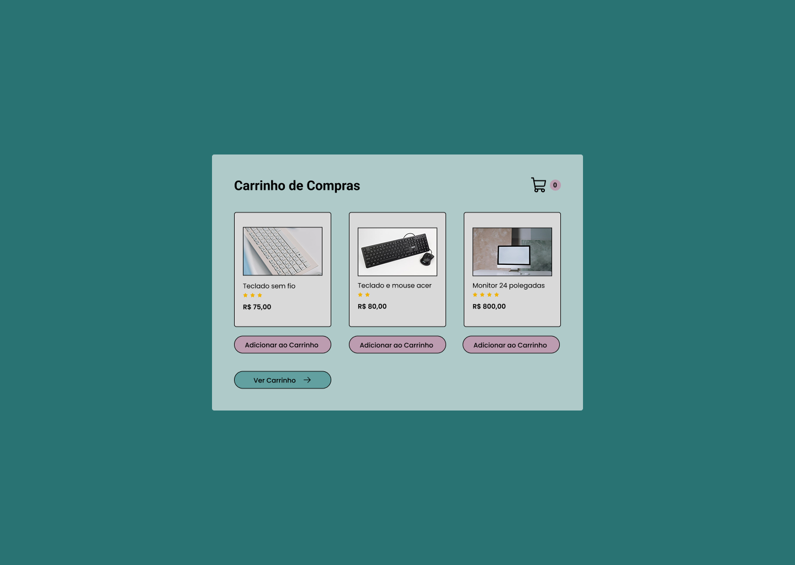

# Desafio: Carrinho de Compras (Nível Difícil)

### Sobre o Desafio 📝

Este desafio tem como objetivo testar suas habilidades com **HTML, CSS e JavaScript**, criando uma aplicação web funcional de um carrinho de compras. Você tem a missão de construir tanto a interface quanto a lógica de funcionamento do carrinho, utilizando recursos como armazenamento de dados, manipulação de DOM e redirecionamento entre páginas.

### Como funciona? 👀🤔

A interface contém três produtos, cada um com um botão de **`Adicionar ao Carrinho`**. Ao clicar em Adicionar ao Carrinho, o produto é salvo no carrinho e a quantidade total é exibida no ícone do carrinho de compras.

Existe um botão **`Ver Carrinho`** abaixo dos botões de **Adicionar ao Carrinho**, que redireciona o usuário para uma nova página com os itens adicionados ao carrinho.

**Na página do carrinho, o usuário consegue visualizar:**

- O nome de cada produto adicionado
- A quantidade de cada produto

No final da página, existe um botão **`Limpar Carrinho`** que remove todos os itens e zera o contador do ícone do carrinho.

### Objetivo 🎯

O objetivo é você colocar em prática conceitos básicos utilizando HTML, CSS e JavaScript, que são muito importantes para o desenvolvimento web.

**O que você vai aprender:**

- Manipulação do DOM com JavaScript
- Armazenamento de dados em variáveis ou localStorage
- Criação de interfaces com HTML e CSS
- Redirecionamento entre páginas
- Atualização dinâmica de conteúdo (quantidades, produtos etc.)

### Requisitos do Desafio

**Interface (página principal):**

- Mostrar três produtos com seus respectivos nomes e um botão **`Adicionar ao Carrinho`** abaixo de cada um.
- Um ícone de carrinho de compras no canto da tela que mostra a quantidade total de itens no carrinho.
- Um botão **`Ver Carrinho`** que redireciona para a página do carrinho.

**Funcionalidades com JavaScript:**

- Ao clicar em **`Adicionar ao Carrinho`**, o produto é salvo no carrinho com controle de quantidade.
- O ícone do carrinho deve mostrar a soma total dos itens adicionados.
- Os dados devem ser mantidos usando localStorage ou estrutura semelhante.

**Página do Carrinho:**

- Mostrar a lista de produtos adicionados com:
  - Nome do produto.
  - Quantidade de vezes que foi adicionado.
- Um botão Limpar Carrinho no final da página que:
  - Zera o localStorage (ou estrutura usada).
  - Atualiza a interface.
  - Zera o contador do carrinho na página principal (ao retornar).

### Link 📎

[Figma - Projeto](https://encurtador.com.br/ULAZn)
