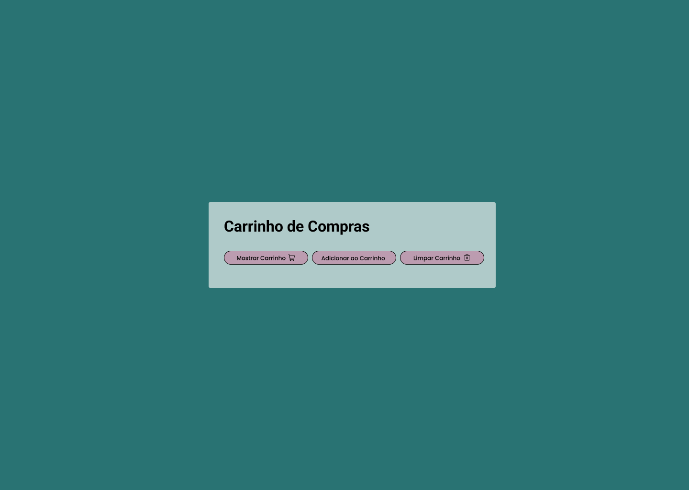

# Desafio: Carrinho de Compras (Nível Médio)

### Sobre o Desafio 📝

Este desafio tem como objetivo testar suas habilidades com **HTML, CSS e JavaScript**, criando um carrinho de compras. Você tem que construir uma interface interativa e implementar uma lógica para manipular a quantidade de produtos no carrinho, com mensagens dinâmicas sendo exibidas na tela.

### Como funciona? 👀🤔

O usuário poderá adicionar produtos ao carrinho, ver a quantidade atual de itens e excluir o carrinho. No entanto, as interações devem ser exibidas por meio de mensagens abaixo dos botões, sem uso de alertas.

### Objetivo 🎯

O objetivo é você colocar em prática conceitos básicos utilizando HTML, CSS e JavaScript, que são muito importantes para o desenvolvimento web.

**O que você vai aprender:**

- Manipulação do DOM com JavaScript
- Estruturação de uma página com HTML
- Estilização de componentes e mensagens com CSS
- Uso de eventos em botões

## Requisitos do Desafio 📑

- Criar uma interface simples com três botões:

  - Adicionar ao Carrinho
  - Mostrar Carrinho
  - Excluir Carrinho

- Um elemento na tela (como um **`
`** ou **`
`**) para exibir as mensagens dinâmicas abaixo dos botões.

- Criar o botão de **Mostrar Carrinho**, com a seguinte lógica:
  > Ao clicar, deve exibir uma mensagem escrita: "Quantidade de produtos no carrinho: X", onde X é a quantidade atual de produtos.
- Criar o botão de **Adicionar ao Carrinho**, com a seguinte lógica:
  > Ao clicar, deve exibir uma mesagem escrita: "Produto adicionado ao carrinho" e aumentar a quantidade de produtos no carrinho.
- Criar o botão de **Limpar Carrinho**, com a seguinte lógica:
  > Ao clicar, deve remover a quantidade de produtos no carrinho e exibir uma mesagem escrita: "Seu carrinho foi esvaziado!".

### Link 📎

[Figma - Projeto](https://encurtador.com.br/VjsR5)
